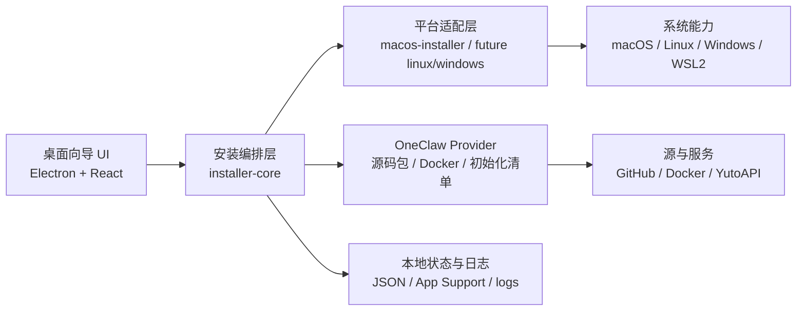

# OneClaw Installer 架构设计

## 1. 项目定位

OneClaw Installer 不是 `OneClaw` 本体的替代品，而是它的图形化安装、初始化与修复入口。

目标用户：

- 没有命令行经验的普通用户
- 希望在本地一键部署 `OneClaw` 的中文用户
- 需要更低学习成本的 macOS 用户

非目标：

- 不重写 `OneClaw` 核心运行时
- 不在第一阶段承诺原生 Windows 直装
- 不为了“看起来一键”而绕开 Docker / WSL2 的真实限制

## 2. 当前约束

当前产品边界已经很明确：

- `OneClaw` 面向普通用户最稳定的本地部署方式是 Docker
- `macOS` 图形安装器当前采用 `Electron + React`
- `Windows` 推荐路线仍然是 `WSL2 + Docker Desktop`
- GUI 安装器负责处理 Docker、工作区、初始化配置、网关启动和验证

因此安装器的职责是：

- 检查系统与 Docker 环境
- 自动选择并执行正确的平台安装路径
- 通过 GUI 表单完成初始化配置
- 提供日志、重试、修复和打开控制台入口

## 3. 顶层架构



### 3.1 UI 层

职责：

- 展示向导式步骤
- 接收用户输入
- 显示阻断、警告、日志和修复动作

当前页面：

- 安全提示
- 环境检查
- Docker 处理
- provider 选择与 API 配置
- 安装进度
- 最后验证
- 打开 OneClaw 图形界面

### 3.2 安装编排层

职责：

- 生成 `InstallPlan`
- 维护统一状态机
- 规范步骤、日志、错误和恢复动作
- 对 UI 输出统一的状态模型

这一层不关心按钮样式，也不直接绑定 macOS / Windows 细节。

### 3.3 平台适配层

职责：

- 与操作系统交互
- 启动和停止本地服务
- 安装或打开 Docker Desktop
- 准备工作区、日志目录和快捷入口
- 在未来的 Windows 路线中接管 `wsl.exe`

当前已落地的是 `packages/macos-installer`。

### 3.4 OneClaw Provider

职责：

- 解析默认源码来源
- 生成 Docker 工作区和镜像策略
- 将 GUI 输入映射为非交互式初始化参数
- 提供健康检查、图形界面入口和验证命令

## 4. 核心决策

### 4.1 用安装计划驱动流程

每次安装都先生成一份 `InstallPlan`，再按步骤执行。

好处：

- UI、日志、错误、重试共用一套模型
- 平台差异收敛在策略生成阶段
- 后续修复、升级、卸载可以复用

### 4.2 macOS 第一阶段坚持 Docker

第一阶段不让小白用户自己处理：

- Node 版本
- npm / pnpm
- PATH
- 守护进程

而是统一走：

- Docker Desktop
- OneClaw Docker 工作区
- GUI 一键初始化

### 4.3 初始化优先走结构化表单

当前默认路径不是把用户直接丢到 `onboard` 的 PTY，会优先走：

- provider 选择
- API key / 模型输入
- 非交互式初始化
- 启动 gateway
- 验证并打开控制台

高级终端只保留为兜底入口。

### 4.4 Windows 只做 WSL2 路线

Windows 端不承诺原生直装，统一按：

- 检测 `WSL2`
- 初始化 `Ubuntu`
- 在 `WSL2` 内运行 Docker 路线的 OneClaw

这样更接近官方支持路径，也更易维护。

## 5. 安装状态机

当前安装阶段可抽象为：

1. `security-gate`
2. `preflight-checks`
3. `resolve-blockers`
4. `prepare-workspace`
5. `configure-provider`
6. `run-guided-setup`
7. `start-gateway`
8. `verify-health`
9. `open-dashboard`

每个阶段都必须具备：

- 用户可读标题
- 结构化状态
- 日志输出
- 可重试性
- 对应的修复动作

## 6. 平台策略

### 6.1 macOS

当前已落地路线：

- 检测系统版本、磁盘和网络
- 检测 Docker CLI / Compose / Engine
- 一键安装或打开 Docker Desktop
- 准备 OneClaw 工作区
- 运行非交互初始化
- 启动并验证 gateway
- 打开 OneClaw 控制台

### 6.2 Linux

规划路线：

- 检测发行版和 Docker Engine / Compose
- 准备工作区
- 运行 Docker 初始化
- 提供日志、重试和修复入口

### 6.3 Windows

规划路线：

- 检测 `WSL2`
- 引导开启系统特性和发行版初始化
- 在 `WSL2` 内准备 Docker 路线
- 提供 Windows 侧打开控制台 / 日志入口

## 7. 数据与持久化

本地持久化拆成三类：

- `settings`
  - 用户偏好、语言、provider 选择
- `state`
  - 当前安装状态、检查结果、最近错误
- `logs`
  - 每次安装和修复的原始日志

关键要求：

- 中断可恢复
- 错误可导出
- 原始错误保留，UI 层只做翻译和整理

## 8. 安全模型

必须遵守：

- 下载来源可追踪
- 管理员权限只在必要步骤申请
- 下载后的临时文件可清理
- API key 不落到公开日志
- GUI 里显示的是解释后的错误，但技术原文仍保留

## 9. 当前仓库结构

```text
apps/
  desktop-installer/
packages/
  installer-core/
  macos-installer/
docs/
  installer/
scripts/
  package-macos-installer.mjs
```

## 10. 当前结论

当前最稳的路线不是继续空想跨平台壳，而是：

- 把 `macOS` 安装主链做到极稳
- 把 `OneClaw` Web 控制台中文化收尾
- 保持安装器、工作区和控制台在同一仓库里协同演进
